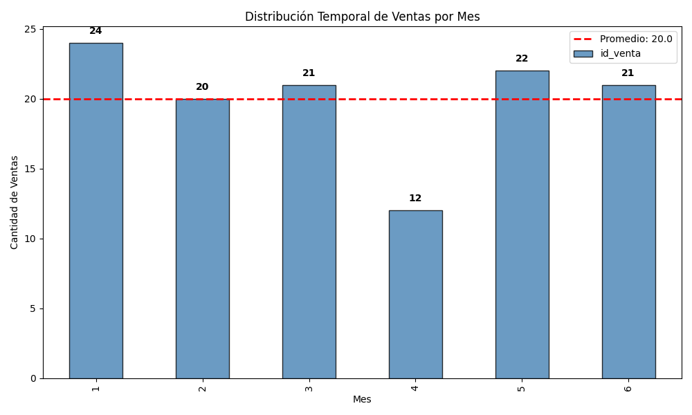
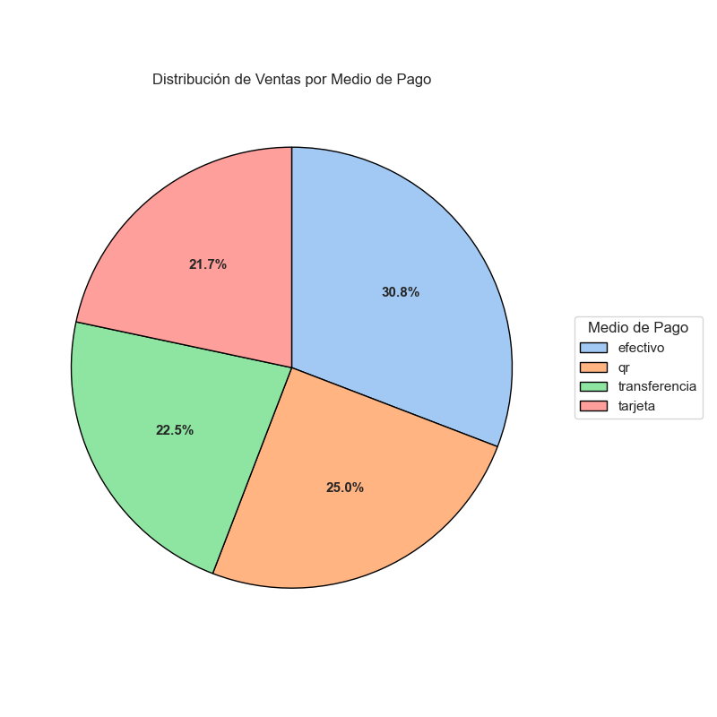
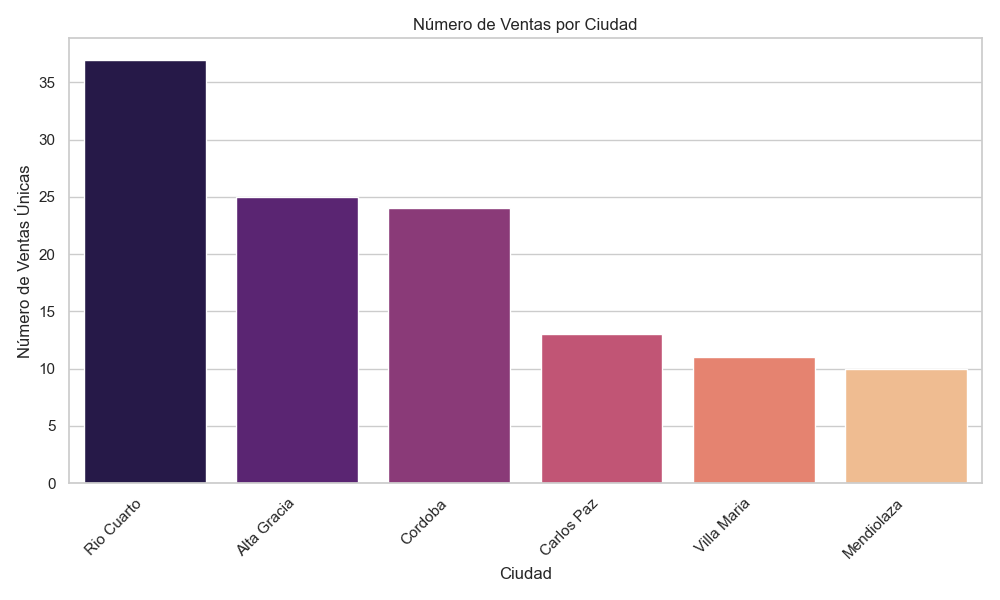
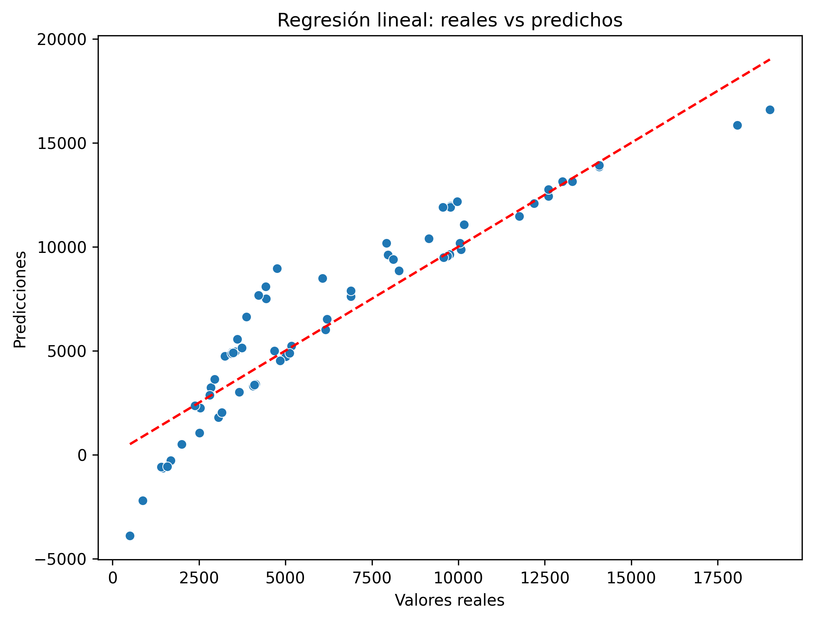
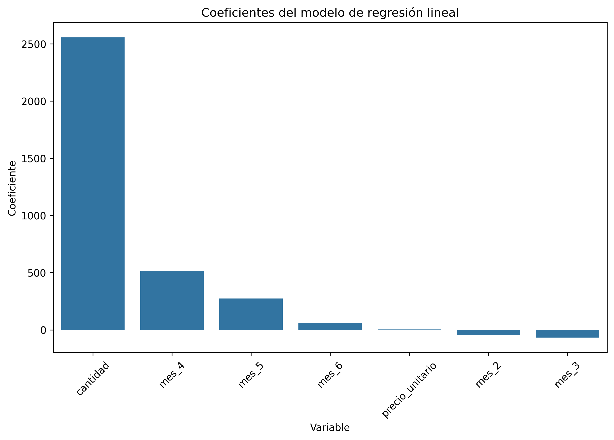
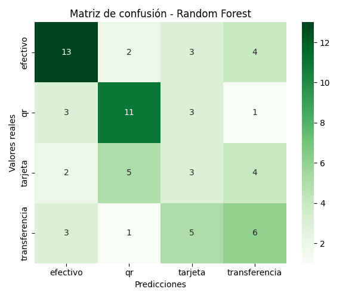
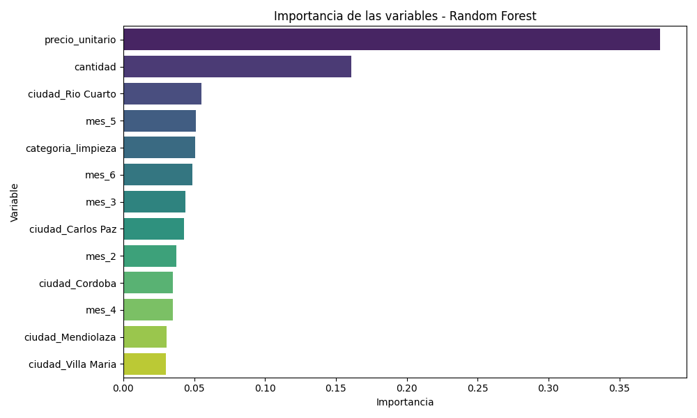

# 📘 Documentación del Proyecto TIENDA AURELION

##  Tema, problema y solución

Este proyecto se enmarca en el contexto de un negocio de ventas minoristas, la Tienda Aurelion, donde se gestionan grandes volúmenes de información relacionados con clientes, productos y transacciones. La disponibilidad de estos datos permite aplicar técnicas de análisis para extraer conocimiento útil que contribuya a mejorar la toma de decisiones operativas y estratégicas.

El enfoque principal consiste en transformar datos crudos en información procesada que permita comprender mejor el comportamiento de compra, identificar patrones de consumo y detectar oportunidades para optimizar procesos comerciales. Esto incluye el análisis de frecuencia de compra y medios de pago utilizados, entre otros.

- **Problema de negocio:** El desafío central es identificar oportunidades para incrementar las ventas, fidelizar clientes y mejorar la eficiencia comercial. Para ello, es necesario entender cómo interactúan los distintos componentes del negocio —clientes, productos, medios de pago, fechas de compra— y qué factores influyen en los resultados.

- **Solución propuesta:** La primera etapa del proyecto se basa en realizar un análisis descriptivo de los datos disponibles, con el objetivo de obtener métricas clave, visualizar tendencias y detectar irregularidades. En etapas posteriores, se plantea aplicar modelos de machine learning para profundizar el análisis, detectar patrones ocultos y generar predicciones que puedan anticipar comportamientos futuros, como la probabilidad de recompra o la respuesta a promociones específicas. Además, se elabora un **tablero en Power BI** que resume los principales indicadores y visualizaciones del negocio, ofreciendo una visión ejecutiva complementaria al análisis en Python.

- **Datos disponibles y primeras observaciones:**  
  La Tienda Aurelion cuenta con un dataset estructurado que integra información de clientes, ventas, productos y detalle de transacciones. Al comenzar el análisis exploratorio se observaron patrones iniciales, como la concentración de ventas en determinados meses, la preferencia marcada por ciertos medios de pago y la existencia de productos con alta rotación frente a otros de baja frecuencia. Estos primeros insights permiten orientar el análisis hacia la detección de estacionalidad, hábitos de consumo y oportunidades de optimización en la gestión comercial.

- **Uso de modelos de ML:** Además del análisis descriptivo, se incorporaron algoritmos como **Regresión Lineal** y **Random Forest** para enriquecer el estudio. Estos modelos permiten tanto estimar valores numéricos (importe de ventas) como anticipar comportamientos (medio de pago más probable), aportando una visión predictiva complementaria.

---

##  Fuente, definición, estructura, tipos y escala

La base de datos está compuesta por cuatro archivos en formato Excel, cada uno representando una tabla distinta:

 1. `clientes.xlsx`
- **Definición:** Información de los clientes registrados.
- **Columnas:** `id_cliente`, `nombre_cliente`, `email`, `ciudad`, `fecha_alta`
- **Cantidad de filas:** 100
- **Tipos y escalas:**
  - `id_cliente`: numérico, discreto, nominal
  - `nombre_cliente`, `email`, `ciudad`: texto, nominal
  - `fecha_alta`: numérico (formato de fecha Excel), intervalo

 2. `ventas.xlsx`
- **Definición:** Registro de cada venta realizada.
- **Columnas:** `id_venta`, `fecha`, `id_cliente`, `nombre_cliente`, `email`, `medio_pago`
- **Cantidad de filas:** 120
- **Tipos y escalas:**
  - `id_venta`, `id_cliente`: numérico, discreto, nominal
  - `fecha`: numérico (formato de fecha Excel), intervalo
  - `medio_pago`: texto, nominal

 3. `detalle_ventas.xlsx`  
- **Definición:** Detalle de productos vendidos en cada venta.  
- **Columnas:** `id_venta`, `id_producto`, `nombre_producto`, `cantidad`, `precio_unitario`, `importe`  
- **Cantidad de filas:** 344  
- **Tipos y escalas:**  
  - `id_venta`, `id_producto`: numérico, discreto, nominal  
  - `cantidad`: numérico, discreto, razón  
  - `nombre_producto`: texto, nominal  
  - `precio_unitario`, `importe`: numérico, razón

 4. `productos.xlsx`
- **Definición:** Catálogo de productos disponibles.
- **Columnas:** `id_producto`, `nombre_producto`, `categoria`, `precio_unitario`
- **Cantidad de filas:** 101
- **Tipos y escalas:**
  - `id_producto`: numérico, discreto, nominal
  - `nombre_producto`, `categoria`: texto, nominal
  - `precio_unitario`: numérico, razón

**Integración de los datos:**  
  Si bien la información se encontraba distribuida en cuatro archivos separados, se realizó un proceso de limpieza y unión que permitió consolidar todo en un único dataset (`ventas_limpio.csv`). Este dataset unificado concentra clientes, ventas, productos y detalle de transacciones en una sola estructura, lo que facilita el análisis exploratorio y la generación de visualizaciones. Gracias a esta integración es posible relacionar variables de distintos orígenes (por ejemplo, medios de pago con categorías de productos o ciudades con volúmenes de ventas) y obtener una visión más completa del negocio.

**Preparación y limpieza de datos:**  
  Una vez cargados los archivos originales, se aplicaron pasos de limpieza y normalización:  
  -  Eliminación de duplicados en todas las tablas.  
  -  Tratamiento de valores faltantes (ej. reemplazo de nulos en textos por “Desconocido” y en números por 0).  
  -  Conversión de fechas al formato `datetime`.  
  -  Homogeneización de strings (ciudades, categorías, medios de pago).    
  -  Unión de las tablas en un único dataset maestro (`ventas_limpio.csv`).  

Este dataset consolidado es el que se utiliza en las etapas posteriores de análisis exploratorio y visualización.  

---

## Pasos, pseudocódigo y diagrama del programa

El programa en Python consta de un menú interactivo que permite consultar la documentación del proyecto y mostrar contenido ya preparado (texto e imágenes).  
No se realizan análisis ni cálculos en tiempo real: todo lo que se muestra proviene del archivo `documentacion.md` o de imágenes pregeneradas.

**Diagrama conceptual del funcionamiento del programa:**

- [Inicio]  
  ↓  
- [Menú interactivo]  
  ↓  
- [Opción seleccionada]  
  ↓  
- [Ejecutar función correspondiente]  
  ↓  
- [Mostrar resultados (texto o imágenes)]  
  ↓  
- [Esperar Enter]  
  ↓  
- [Volver al menú]

**Pseudocódigo:**

- Inicio del programa  
- Mostrar menú con opciones  
- Mientras el usuario no elija "Salir":  
    - Leer la opción seleccionada  
    - Llamar a la función correspondiente:  
        - `mostrar_seccion()` para mostrar texto desde `documentacion.md`  
        - `mostrar_eda()` para ver imágenes del EDA  
        - `mostrar_estadisticas()` para ver la sección de estadísticas  
        - `mostrar_viz()` para ver visualizaciones de negocio  
        - `mostrar_ml()` para ver modelos de Machine Learning  
        - `mostrar_dashboard()` para navegar el submenú de Power BI  
    - Cada función muestra contenido ya preparado:  
        - texto mediante `mostrar_seccion()`  
        - imágenes mediante `mostrar_imagen()`  
    - Esperar que el usuario presione Enter  
- Fin del programa

 **Nota:** El programa no realiza cálculos, análisis ni entrenamientos de modelos en tiempo real.  
 Todos los resultados que se muestran, estadísticas, EDA, visualizaciones, modelos de Machine Learning y gráficos,  fueron generados previamente durante el desarrollo del proyecto.  
 Durante la ejecución desde la terminal, el programa simplemente muestra ese contenido ya preparado, ya sea leyendo texto desde `documentacion.md` mediante `mostrar_seccion()` o mostrando imágenes pregeneradas mediante `mostrar_imagen()`.

## Estadística

**Estadística del dataset `ventas_limpio.csv`**

**Variables**
- **Numéricas:** `id_venta`, `id_producto`, `cantidad`, `precio_unitario`, `importe`, `id_cliente`, `mes`
- **Categóricas:** `nombre_producto`, `fecha`, `nombre_cliente`, `email`, `medio_pago`, `categoria`, `ciudad`, `fecha_alta`

---

**Estadística descriptivas**

| Variable        | Count | Mean   | Std    | Min  | 25%   | 50%   | 75%   | Max    |
|-----------------|-------|--------|--------|------|-------|-------|-------|--------|
| id_venta        | 343   | 61.49  | 34.84  | 1.00 | 31.00 | 61.00 | 93.00 | 120.00 |
| id_producto     | 343   | 49.14  | 29.14  | 1.00 | 23.00 | 47.00 | 76.00 | 100.00 |
| cantidad        | 343   | 2.96   | 1.37   | 1.00 | 2.00  | 3.00  | 4.00  | 5.00   |
| precio_unitario | 343   | 2654.50| 1308.69| 272.00|1618.50|2512.00|3876.00| 4982.00|
| importe         | 343   | 7730.08| 5265.54| 272.00|3489.00|6702.00|10231.50|24865.00|
| id_cliente      | 343   | 45.54  | 28.44  | 1.00 | 20.00 | 43.00 | 67.00 | 100.00 |
| mes             | 343   | 3.46   | 1.80   | 1.00 | 2.00  | 3.00  | 5.00  | 6.00   |

---

**Análisis de valores faltantes**
✅ No se detectaron valores faltantes en el dataset.

---

**Asimetría (Skewness) de variables numéricas**
- `id_venta`: -0.01 → distribución prácticamente simétrica  
- `id_producto`: 0.07 → simétrica  
- `cantidad`: 0.06 → simétrica  
- `precio_unitario`: 0.17 → ligera asimetría positiva  
- `importe`: 0.87 → asimetría positiva marcada (cola hacia la derecha)  
- `id_cliente`: 0.18 → ligera asimetría positiva  
- `mes`: 0.02 → simétrica  

---

**Detección de outliers**
- `importe`: **7 outliers detectados** (valores extremos en montos de venta)  
- Todas las demás variables: **0 outliers detectados**

---

### 📌 Interpretación
- La mayoría de las variables numéricas presentan distribuciones bastante simétricas, salvo `importe`, que muestra una asimetría positiva y algunos valores extremos.  
- Esto sugiere que existen ventas con montos significativamente más altos que el promedio, lo cual puede ser relevante para el análisis de negocio.  
- La ausencia de valores faltantes asegura que el dataset está limpio y listo para análisis más avanzados.

## Exploratory Data Analysis (EDA)

Con el dataset maestro ya preparado (`ventas_limpio.csv`), se realizaron distintos análisis exploratorios para comprender mejor la estructura y el comportamiento de los datos:

- Estadísticas descriptivas: resumen de las variables numéricas (media, desviación estándar, mínimos y máximos).  
- Identificación de tipos de variables: separación entre variables numéricas y categóricas para orientar los análisis.  
- Valores faltantes: verificación de columnas con nulos y visualización con gráfico de barras.  
- Distribución de variables numéricas: histogramas con densidad para detectar sesgos y patrones de frecuencia.  
- Asimetría (skewness): cálculo de la simetría en las distribuciones para identificar variables sesgadas.  
- Detección de outliers: aplicación del rango intercuartílico (IQR) para encontrar valores extremos.    
- Matriz de correlación numérica: se calcularon correlaciones entre todas las variables numéricas del dataset y se representaron en un heatmap. 

## Matriz de correlación (ventas_limpio.csv)

| Variable        | id_venta | id_producto | cantidad | precio_unitario | importe | id_cliente | mes   |
|-----------------|----------|-------------|----------|-----------------|---------|------------|-------|
| id_venta        | 1.00     | -0.04       | 0.04     | -0.09           | -0.06   | -0.04      | -0.09 |
| id_producto     | -0.04    | 1.00        | 0.08     | 0.00            | 0.05    | 0.03       | -0.08 |
| cantidad        | 0.04     | 0.08        | 1.00     | -0.07           | 0.60    | 0.01       | 0.02  |
| precio_unitario | -0.09    | 0.00        | -0.07    | 1.00            | 0.68    | -0.05      | 0.06  |
| importe         | -0.06    | 0.05        | 0.60     | 0.68            | 1.00    | -0.03      | 0.07  |
| id_cliente      | -0.04    | 0.03        | 0.01     | -0.05           | -0.03   | 1.00       | 0.19  |
| mes             | -0.09    | -0.08       | 0.02     | 0.06            | 0.07    | 0.19       | 1.00  |

- Pairplot de variables clave: se analizaron las relaciones entre `cantidad`, `precio_unitario` e `importe`, coloreadas por la variable `categoria`.  

Estos pasos permitieron detectar patrones de consumo, relaciones entre variables y posibles irregularidades (como outliers o sesgos), preparando el terreno para las visualizaciones de negocio.

## Insights

A partir de las visualizaciones generadas durante el análisis exploratorio, se identificaron los siguientes insights clave:

**1. Relación entre cantidad e importe**  
- Existe una correlación positiva moderada (≈0.60) entre `cantidad` e `importe`.  
- Esto confirma que el volumen de unidades vendidas es un motor clave del ingreso, aunque no explica por sí solo las variaciones más grandes (donde el precio unitario también influye).  

---

**2. Distribución temporal: Ventas por mes**  
- **Total de ventas únicas:** 120  
- **Promedio mensual:** 20.00 ventas  
- **Desvío estándar:** 4.15  
- La mayoría de los meses tienen entre **16 y 24 ventas**, con una distribución **multimodal**.  
- **Coeficiente de variación:** 20.74% → variabilidad **moderada**.  

**Interpretación:**  
Las ventas mensuales son relativamente estables, con cierta variabilidad pero sin extremos.

---

**Medios de pago**  
- El medio más utilizado para ventas únicas es **efectivo**, que además concentra los tickets más altos.  
- **QR** muestra mayor heterogeneidad en montos, reflejando diversidad en los valores de transacción.  
- **Tarjeta** es el medio más homogéneo, con menor rango de variación y tickets promedio más bajos.  

**Interpretación:**  
El efectivo sigue siendo el canal dominante y más rentable, mientras que QR refleja un comportamiento más variado y tarjeta aporta estabilidad pero con menor valor promedio.

---

**3. Distribución geográfica: Ventas por ciudad**  
- **Total de ventas únicas:** 120  
- **Promedio por ciudad:** 20.00 ventas  
- **Desvío estándar:** 10.58  
- **Coeficiente de variación:** 52.92% → variabilidad **alta** entre ciudades.  

**Observaciones del gráfico de barras:**  
- **Río Cuarto:** mayor cantidad de ventas únicas, ciudad líder en actividad.  
- **Alta Gracia y Córdoba:** siguen en importancia, con volúmenes relevantes.  
- **Carlos Paz, Villa María y Mendiolaza:** menor número de ventas únicas.  

**Interpretación:**  
La distribución por ciudad es desigual, con Río Cuarto claramente destacada. Esto sugiere que la estrategia comercial debería considerar un enfoque diferenciado por región, potenciando las ciudades con mayor actividad y explorando oportunidades en las de menor volumen.

---

**📌 Conclusión general**

El negocio muestra estabilidad temporal en las ventas, con variabilidad moderada mes a mes.  
El **efectivo** es el medio de pago más relevante, tanto en frecuencia como en ticket promedio.  
Geográficamente, **Río Cuarto concentra la mayor actividad**, mientras que otras ciudades presentan menor participación.  
Además, el volumen de unidades vendidas y el precio unitario son los dos factores principales que explican los ingresos, con algunos outliers en `importe` que representan oportunidades estratégicas.

## Aplicación de modelos de Machine Learning

El uso de algoritmos de *machine learning* en este proyecto tiene como objetivo transformar los datos de ventas en información útil para la toma de decisiones. A través de técnicas supervisadas, buscamos tanto **predecir valores numéricos** como **anticipar comportamientos**.

- **Regresión lineal**: se aplica para estimar el **importe de las ventas** en función de variables numéricas como cantidad, precio unitario y mes. Este modelo permite evaluar la precisión de las predicciones y entender el peso relativo de cada variable en el resultado.

- **Clasificación supervisada**: se utiliza para predecir el **medio de pago** más probable según las características de la transacción (importe, cantidad, categoría, ciudad, mes). Con ello se pueden identificar patrones de comportamiento de los clientes y anticipar sus preferencias.

La combinación de ambos enfoques ofrece una visión complementaria: la regresión aporta una estimación cuantitativa del importe, mientras que la clasificación ayuda a comprender y anticipar decisiones de los clientes. En conjunto, estos modelos permiten aprovechar los datos para mejorar la planificación y diseñar estrategias más informadas.

*Nota:* Esta sección resume el trabajo realizado en la notebook de Machine Learning. La notebook no se incluye en el repositorio para mantenerlo liviano y enfocado, pero aquí se detallan los pasos, decisiones y resultados principales.

### Regresión Lineal

**Objetivo:**  
Predecir el importe de las ventas a partir de variables numéricas (`cantidad`, `precio_unitario`) y temporales (`mes` codificado con One-Hot).

**Algoritmo elegido y justificación:**  
Se utilizó **Regresión Lineal** porque es un modelo simple, interpretable y adecuado para problemas de predicción de valores numéricos. Además, permite cuantificar el impacto de cada variable predictora sobre el importe y evaluar la presencia de estacionalidad mediante la codificación de los meses.

**Entradas (X) y salida (y):**  
- **X:** cantidad, precio_unitario, mes_2, mes_3, mes_4, mes_5, mes_6, …  
- **y:** importe  

**Métricas de evaluación:**  
- **MSE (Mean Squared Error):** 2,655,368.94.  
  - Representa el promedio de los errores al cuadrado. Al estar en la escala del importe², puede parecer grande.  
- **RMSE (Root Mean Squared Error):** ≈ 1629.6.  
  - Es la raíz del MSE y devuelve el error en la misma escala que el importe. Indica que el modelo se equivoca en promedio unos 1629 unidades monetarias.  
- **R² (Coeficiente de determinación):** 0.846.  
  - Explica que el modelo logra capturar el 84.6% de la variabilidad del importe, lo cual es un desempeño sólido.

**Modelo ML implementado:**  
Se instanció un modelo de regresión lineal con `LinearRegression()` y se entrenó sobre los datos de entrenamiento.

**División train/test y entrenamiento:**  
Los datos se dividieron en 80% entrenamiento y 20% prueba, con `random_state=42` para reproducibilidad.  
El modelo se entrenó con `lin_reg.fit(X_train, y_train)`.

**Predicciones y métricas calculadas:**  
Las predicciones se obtuvieron con `lin_reg.predict(X_test)`.  
Se calcularon MSE, RMSE y R² para evaluar el desempeño del modelo.  
Los coeficientes muestran el peso de cada variable:  
- `cantidad` es la más influyente (coef. ≈ 2556).  
- `precio_unitario` también contribuye positivamente (coef. ≈ 3).  
- Algunos meses (ej. mes_4 y mes_5) tienen efecto positivo, mientras que otros (mes_2 y mes_3) muestran impacto negativo.

**Resultados en gráficos:**  
- **Gráfico de dispersión (valores reales vs predichos):**  
  Muestra cómo se alinean las predicciones con los valores reales. La cercanía a la línea identidad indica buena capacidad predictiva.  
  

- **Gráfico de barras de coeficientes:**  
  Representa la magnitud y signo de cada variable en el modelo. Permite interpretar qué factores aumentan o disminuyen el importe.  
  

### Clasificación supervisada con Random Forest

**Objetivo:**  
Clasificar el medio de pago utilizado en las transacciones a partir de variables numéricas y categóricas.

**Algoritmos probados y justificación:**  
- **Logistic Regression**  
  Accuracy: ~0.38 – 0.43  
  Problemas: bajo desempeño y dificultades de convergencia.  
  Motivo: dataset pequeño y clases desbalanceadas.  

- **XGBoost (Gradient Boosting)**  
  Accuracy: ~0.39  
  Problemas: no mejoró respecto a Random Forest.  
  Motivo: boosting necesita más datos para aprender patrones complejos.  

- **Random Forest (modelo elegido)**  
  Accuracy: ~0.45 – 0.48  
  Justificación:  
  - Más estable en datasets pequeños.  
  - Maneja bien variables categóricas codificadas como dummies.  
  - Permite interpretar la importancia de las variables.  
  - Mejor desempeño global que los otros modelos.  

**Entradas (X) y salida (y):**  
- **y:** la variable objetivo `medio_pago` fue codificada con `LabelEncoder`.  
- **X:** incluye variables numéricas (`cantidad`, `precio_unitario`) y categóricas (`categoria`, `ciudad`, `mes`) transformadas mediante One-Hot Encoding.  

**Métricas de evaluación:**  
- **Accuracy:** proporción de predicciones correctas.  
- **Precision, Recall y F1-score por clase:** permiten evaluar el desempeño en cada medio de pago.  
- **Matriz de confusión:** muestra cómo se distribuyen los aciertos y errores de clasificación.  

**Modelo ML implementado:**  
Se instanció un modelo de Random Forest con los siguientes parámetros:  
- `n_estimators=200`  
- `random_state=42`  
- `class_weight="balanced"`  

**División train/test y entrenamiento:**  
Los datos se dividieron en 80% entrenamiento y 20% prueba, con `random_state=42` y división estratificada para mantener la proporción de clases.  
El modelo se entrenó con `clf_rf.fit(X_train, y_train)`.  

**Predicciones y métricas calculadas:**  
Las predicciones se obtuvieron con `clf_rf.predict(X_test)`.  
- Accuracy final: ~0.45 – 0.48  
- Resultados por clase:  
  - Clase 0 y 1: desempeño aceptable (recall ~0.55–0.61)  
  - Clase 3: desempeño intermedio (recall ~0.40–0.60)  
  - Clase 2: desempeño bajo (recall ~0.14–0.21)  

**Motivos de accuracy baja:**  
- Dataset pequeño.  
- Clases desbalanceadas (clase 2 con pocos ejemplos).  
- Variables poco discriminantes (precio y cantidad dominan, pero no separan todas las clases).  
- Ruido en variables categóricas (ciudades y meses aportan poco).  

**Resultados en gráficos:**  
- **Matriz de confusión:**  
  Muestra cómo se distribuyen las predicciones frente a los valores reales. Se observa que la clase 2 se confunde con otras, mientras que las clases 0 y 1 se predicen mejor.  
  

- **Importancia de variables:**  
  Representa el aporte de cada variable al modelo. `precio_unitario` y `cantidad` son las más influyentes, mientras que las variables de ciudad y mes tienen menor aporte.  
  

**Conclusión:**  
Se eligió Random Forest como modelo final por su estabilidad y mejor desempeño en este dataset.  
Aunque la accuracy (~0.45–0.48) no es muy alta, se justifica por el tamaño reducido del dataset y el desbalance de clases.  
El modelo constituye una base sólida para futuras mejoras:  
- Recolección de más datos  
- Balanceo de clases (SMOTE)  
- Ingeniería de nuevas features  

## Dashboard en Power BI – Tienda Aurelion

### Objetivo
El dashboard busca **conocer los comportamientos generales del negocio**, mostrando métricas clave, tendencias y comparaciones que permiten entender mejor la dinámica de ventas, clientes, productos y medios de pago.

---

### General
**Indicadores principales**
- Total Ventas: $2,65 millones  
- Ticket Promedio: $22,10 mil  
- Cantidad Vendida: 1,016 mil unidades  

**Visuales**
- Evolución temporal de las ventas (serie temporal por fecha)  
- Cantidad total por categoría (comparación alimentos vs limpieza)  

---

### Clientes
**Indicadores**
- Total de clientes: 67  
- Ticket promedio por cliente: $39,57 mil  

**Visuales**
- Importe total por ciudad (barplot)  
- Top 10 clientes por importe  
- Scatter: frecuencia de compras vs importe total por cliente  

---

### Productos y Categorías
**Visuales**
- Top 5 productos más vendidos  
- Mapa de calor: ventas por ciudad y categoría  
- Evolución de ventas por categoría (serie temporal alimentos vs limpieza)  

---

### Medios de Pago
**Visuales**
- Treemap de medios de pago  
- Evolución temporal de ventas por medio de pago (líneas comparativas)  
- Cantidad vendida por mes y medio de pago (barras apiladas)  
- Cantidad por medio de pago y categoría (columnas agrupadas)  

---

### Conclusión
El dashboard ofrece una visión integral del negocio:  
- **General:** magnitud de ventas y evolución temporal.  
- **Clientes:** identificación de clientes estratégicos y distribución geográfica.  
- **Productos:** productos líderes y patrones por categoría/ciudad.  
- **Medios de pago:** preferencias y tendencias en las formas de pago.  

En conjunto, permite detectar patrones de consumo, hábitos de pago y oportunidades de mejora comercial.

##  Sugerencias de Copilot

En términos generales, el uso de Copilot durante el desarrollo del proyecto fue positivo. La herramienta permitió avanzar con rapidez en la escritura de funciones, estructuración del programa y generación de contenido técnico. Muchas de las sugerencias iniciales resultaron útiles.

Sin embargo, en algunos momentos, especialmente al intentar corregir código existente, Copilot tendía a repetir soluciones que no funcionaban o a insistir en enfoques que ya se habían descartado. Esto se notó particularmente al intentar eliminar ciertos caracteres (backticks) de la visualización del programa. A pesar de múltiples intentos, las soluciones propuestas no resolvieron el problema, lo que llevó a buscar una alternativa fuera del enfoque sugerido. Otro error ocurrió al leer de manera incorrecta algunos valores de las tablas de excel, como la cantidad de filas. 

---

Alumna: Lucía Páez Gayone

Diciembre, 2025.

Programa Fundamentos en Inteligencia Artificial de IBM SkillsBuild y Guayerd.